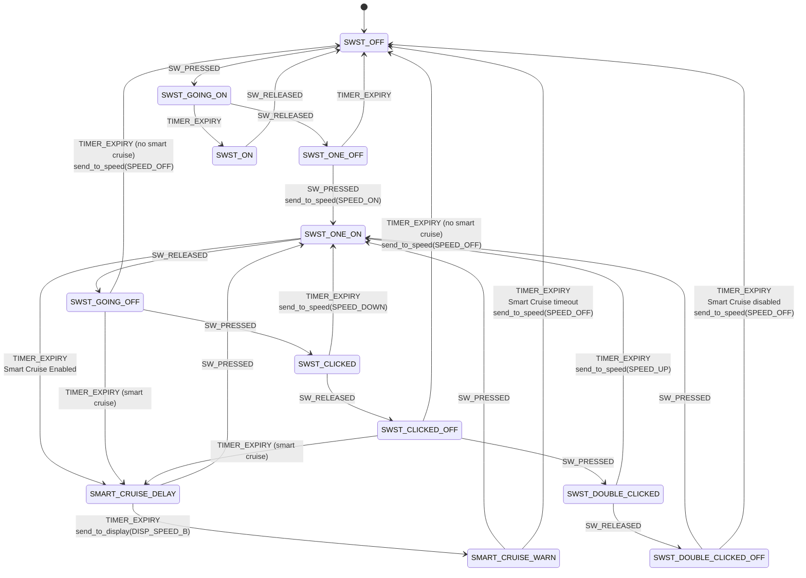

# Improved Firmware for the Dive Xtras Blacktip DPV (VESC based)

[](https://www.gnu.org/licenses/gpl-3.0)

This is a fork of the [manufacturer supplied](https://github.com/claroworks-product-development/Sikorski) firmware for the Dive Xtras Blacktip DPV (original [README](README_upstream.md)).

An open source motor controller firmware.

This is BASED ON the source code for the VESC DC/BLDC/FOC controller. Read more at  
[https://vesc-project.com/](https://vesc-project.com/)


## Improvements

- 'Smart Cruise' mode


### 'Smart Cruise' Mode

Cruise along without having to hold down the trigger at all times. Do so in a save way as the motor will stop if no trigger activation is detected for some time (currently hardcoded to 30 seconds).


## Prerequisites

### On Ubuntu

Install the gcc-arm-embedded toolchain. Recommended version ```gcc-arm-none-eabi-7-2018-q2```  

**Method 1 - Through Official GNU Arm Embedded Toolchain Downloads**
1. Go to [GNU Arm Embedded Toolchain Downloads](https://developer.arm.com/tools-and-software/open-source-software/developer-tools/gnu-toolchain/gnu-rm/downloads)
2. Locate and Download version **gcc-arm-none-eabi-7-2018-q2** for your machine  
   ```GNU Arm Embedded Toolchain: 7-2018-q2-update     June 27, 2018```  
   Linux 64-bit version can be downloaded from [here](https://developer.arm.com/-/media/Files/downloads/gnu-rm/7-2018q2/gcc-arm-none-eabi-7-2018-q2-update-linux.tar.bz2?revision=bc2c96c0-14b5-4bb4-9f18-bceb4050fee7?product=GNU%20Arm%20Embedded%20Toolchain,64-bit,,Linux,7-2018-q2-update)  
3. Unpack the archive in the file manager by right-clicking on it and select "extract here"
4. Change directory to the unpacked folder, unpack it in /usr/local by execute the following command
   ```
   cd gcc-arm-none-eabi-7-2018-q2-update-linux  
   sudo cp -RT gcc-arm-none-eabi-7-2018-q2-update/ /usr/local  
   ```

**Method 2 - Through apt install**
```bash
sudo add-apt-repository ppa:team-gcc-arm-embedded/ppa
sudo apt update
sudo apt install gcc-arm-embedded
```


**Optional - Add udev rules to use the stlink v2 programmer without being root**
```bash
wget vedder.se/Temp/49-stlinkv2.rules
sudo mv 49-stlinkv2.rules /etc/udev/rules.d/
sudo udevadm trigger
```

### On MacOS

Go to the [GNU ARM embedded toolchain downloads Website](https://developer.arm.com/tools-and-software/open-source-software/developer-tools/gnu-toolchain/gnu-rm/downloads) and select the mac version, download it and extract it to your user directory.

Append the bin directory to your **$PATH**. For example:


```bash
export PATH="$PATH:/Users/your-name/gcc-arm-none-eabi-8-2019-q3-update/bin/"
```

Install stlink and openocd


```bash
brew install stlink
brew install openocd
```

## Build
Clone and build the firmware

```bash
git clone git@github.com:claroworks-product-development/Sikorski.git sikorski
cd sikorski
make
```

Create the firmware 
```bash
make
```

Use the [Vesc Tool](https://vesc-project.com/vesc_tool) (included for ubuntu, vesc_tool_1.16) to update the firmware. The firmware is in the build/ directory - BLDC_4_ChibiOS.elf

## Smart Cruise Mode

### 'Smart Cruise' Mode

The Sikorski firmware implements an intelligent Smart Cruise Mode feature that automatically maintains propulsion without requiring continuous trigger input. This advanced system is built on a sophisticated trigger control state machine that manages user input through precise timing sequences and click patterns.

#### Overview

Smart Cruise Mode automatically activates after 5 seconds of continuous motor operation, allowing the diver to maintain speed without holding the trigger. The system includes a warning phase before timeout and can be controlled through specific trigger input patterns.

#### Trigger State Machine

The Smart Cruise functionality is implemented through the trigger thread (`trigger_thread` in `applications/trigger.c`) using a finite state machine with the following behavior:



#### Smart Cruise States

The Smart Cruise system utilizes specific states within the trigger state machine:

- **SMART_CRUISE_DELAY**: Active smart cruise mode - motor continues running without trigger input
- **SMART_CRUISE_WARN**: Warning phase before timeout - displays speed warning to user
- **SWST_ONE_ON**: Normal motor operation that can transition to smart cruise after timer expiry
- **SWST_GOING_OFF**: Released trigger state that can maintain smart cruise or turn off motor

#### Usage Patterns

##### Activating Smart Cruise
1. **Double-click** to start motor: `SWST_OFF` → `SWST_ONE_ON` 
2. **Wait 5 seconds** for automatic activation: `SWST_ONE_ON` → `SMART_CRUISE_DELAY`
3. Motor continues running without trigger input

##### Speed Control in Smart Cruise
- **Single-click**: Decrease speed while maintaining smart cruise
- **Triple-click**: Increase speed while maintaining smart cruise  
- **Any trigger input**: Immediately returns to active control from warning state

##### Deactivating Smart Cruise
- **Triple-click sequence**: Manually disable smart cruise and turn off motor
- **Timeout**: System automatically turns off motor after warning period
- **Any trigger input during warning**: Restart smart cruise timer

## License

The software is released under the GNU General Public License version 3.0
